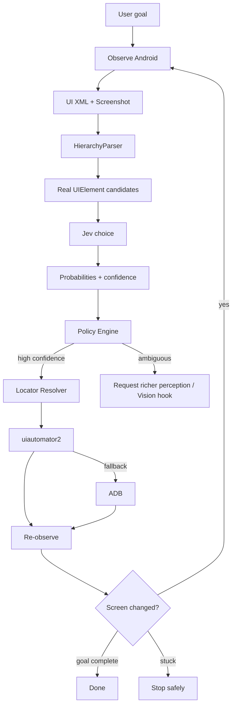

<div align="center">

# 🤖 Jevii Android

### Probabilistic Android UI agent powered by **Jev + uiautomator2 + ADB**

[](https://github.com/Doringber/jevii-android/stargazers)


**See the screen → discover real UI elements → let Jev rank the options → execute with a reliable locator → verify what changed.**

</div>

---

## ⭐ Why this project exists

Most AI phone-control demos do this:

```text
screenshot → large model → guessed coordinates → tap
```

That can work, but it is expensive, hard to debug, and fragile.

Jevii Android takes a different approach:

```text
Android UI hierarchy + screenshot
            ↓
     discover real elements
            ↓
      build good candidates
            ↓
     Jev probability ranking
            ↓
        safety policy
            ↓
    best deterministic locator
            ↓
      uiautomator2 / ADB
            ↓
          verify
```

The core idea is simple:

> **Jev decides WHAT to interact with. Android automation decides HOW to find and execute it.**

Jev never needs to invent a resource ID, XPath, or screen coordinate.

---

## 🧠 How it works



For every actionable Android node, the perception layer extracts:

- visible `text`
- `resource-id`
- `content-desc`
- Android class / semantic role
- screen bounds
- parent and sibling text context
- generated XPath
- multiple executable locators with reliability scores

Example candidate:

```json
{
  "id": "e017",
  "text": "Network & internet",
  "resource_id": "com.example:id/network_and_internet",
  "class_name": "android.widget.Button",
  "clickable": true,
  "parent_text": "Settings",
  "nearby_text": ["Internet", "Connected network"],
  "locators": [
    {"strategy": "resource_id", "reliability": 0.99},
    {"strategy": "text", "reliability": 0.91},
    {"strategy": "xpath", "reliability": 0.80},
    {"strategy": "coordinates", "reliability": 0.45}
  ]
}
```

Jev receives the **real candidates**, not a free-form request to invent a selector.

Example decision:

```json
{
  "choice": "e017",
  "probabilities": {
    "e017": 0.91,
    "e004": 0.06,
    "e021": 0.03
  },
  "confidence": 0.88
}
```

The policy then calculates:

```text
execution_score =
  selected_probability
  × Jev_confidence
  × locator_reliability
```

If the result is too ambiguous, the agent **does not blindly click**.

---

## 🔎 Locator strategy

Locators are generated from the real Android hierarchy and ranked deterministically:

1. 🥇 unique `resource-id`
2. 🥈 unique `content-desc`
3. 🥉 unique visible text
4. XPath generated from the hierarchy
5. screen coordinates as the last fallback

Example execution:

```python
d(resourceId="com.example:id/network_and_internet").click()
```

If that is unavailable, the executor can fall back through other known locators instead of asking Jev to guess one.

---

# 🚀 Quick start

## Requirements

- Python 3.11+
- Android Platform Tools (`adb`)
- Android Emulator **or** physical Android device
- `TYPESAFE_API_KEY` for Jev

### Install

```bash
git clone https://github.com/Doringber/jevii-android.git
cd jevii-android

python3 -m venv .venv
source .venv/bin/activate
pip install -e .

export TYPESAFE_API_KEY="your-key"
```

Verify the environment:

```bash
jevii-android doctor
```

Example output:

```json
{
  "adb_devices": ["emulator-5554"],
  "uiautomator2": true,
  "typesafe_key_present": true
}
```

---

# 📱 Run it on an Android Emulator

Yes — **an emulator is the easiest way to test the project.**

You can use any normal Android Studio AVD.

## Option A — Android Studio

1. Open **Android Studio → Device Manager**.
2. Create an AVD, for example `Pixel_8_API_35`.
3. Start the emulator.
4. Confirm ADB sees it:

```bash
adb devices
```

Expected:

```text
List of devices attached
emulator-5554    device
```

Then:

```bash
export ANDROID_SERIAL=emulator-5554
jevii-android doctor
```

## Option B — command line

If the Android SDK emulator is in your `PATH`:

```bash
emulator -list-avds
emulator -avd Pixel_8_API_35
```

Or use the helper included in this repo:

```bash
./scripts/emulator_demo.sh Pixel_8_API_35
```

The helper:

- starts the AVD if it is not already running
- waits until Android finishes booting
- opens Android Settings
- prints the detected emulator serial
- runs `jevii-android doctor`
- prints the exact demo command to run next

---

# 🧪 First emulator demo — no APK required

Use Android's built-in **Settings** app as a safe test target.

Start Settings:

```bash
adb shell am start -a android.settings.SETTINGS
```

Then run:

```bash
jevii-android run \
  "Open Network & internet settings"
```

The intended flow is:

```text
Settings screen
     ↓
collect XML + screenshot
     ↓
find visible clickable rows
     ↓
Jev ranks candidates
     ↓
"Network & internet" receives highest probability
     ↓
resolve its best locator
     ↓
tap
     ↓
re-observe
     ↓
verify the Settings screen changed
```

You can also try:

```bash
jevii-android run "Open Display settings"
```

```bash
jevii-android run "Open Battery settings"
```

> Tip: use an English-language AVD for the first smoke test so the goals above match the visible Settings labels.

## Reusable QA and product use cases

Write a use case in plain language inside a TOML file in `examples/`. The `[apps]` table maps the names people use to Android package IDs; each app may also define a known launcher `activity`, `search_text`, or `home_text` so stable controls can be selected directly. `story` describes the steps. The local compiler turns supported instructions into checked Android operations and Jev navigation goals.

```toml
name = "IMDb movie research survives an app switch"
story = """
Open IMDb.
Search for "The Martian".
Open the 2015 movie title.
Switch to Box.
Return to IMDb.
Verify the screen shows "The Martian".
"""

[apps.IMDb]
package = "com.imdb.mobile"
activity = ".HomeActivity"
search_text = "Search for shows, movies, people…"
home_text = "Search for shows, movies, people…"

[apps.Box]
package = "com.box.gallery"
activity = ".MainActivity"
```

Run it on the selected emulator/device:

```bash
jevii-android run-case examples/imdb_box_quick_handoff.toml --serial emulator-5554
```

Compile the NLP story and inspect its complete plan without connecting to Android or Jev:

```bash
jevii-android run-case examples/imdb_box_quick_handoff.toml --check
```

Run the quick handoff and the longer force-stop/relaunch check separately:

```bash
jevii-android run-case examples/imdb_box_quick_handoff.toml --serial emulator-5554
jevii-android run-case examples/imdb_box_lifecycle.toml --serial emulator-5554
```

The NLP compiler supports opening/switching/restarting mapped apps, visiting a URL in a mapped browser, searching for a quoted phrase, opening its movie/title page, quoted text taps and typing, Enter, Back, Home, waits, and checks for visible quoted text or an app home screen. Instructions it cannot map produce a structured issue and stop before Android is touched; it never silently drops a sentence. Use explicit TOML `[[steps]]` for an action outside this language, or express that one navigation as a Jev `goal`.

Supported structured steps are `goal`, `open_app`, `open_url` (optional `package`), `tap_text`, `type_text`, `enter`, `wait_ms`, `home`, `back`, `relaunch_app`, `assert_app`, and `assert_text`. Each `goal` uses Jev to choose UI actions and can override `max_steps`; direct operations avoid extra model calls. App launch waits up to four seconds by default, app/text assertions up to 1.5 seconds, and optional text taps only 0.3 seconds. Override `timeout_seconds` on any waitable step when a device is slower. Jev API requests time out after 12 seconds by default; set `JEV_REQUEST_TIMEOUT_SECONDS` to tune that limit. Fixed sleeps are unnecessary for app and text checks; `wait_ms` remains available for real timed behavior.

Cases stop at the first failed action/assertion and return its duration, expected/actual values, and an issue code with the next diagnostic check. Jev goal traces and screenshots are written under `.runs/`. `--check` prints the compiled plan; the run output reports each step’s duration so you can identify slow actions. The parser deliberately supports a documented subset of natural language; ambiguous or unsupported instructions are reported for correction rather than guessed.

The Settings example assumes the emulator is on the main Settings screen, where **Network & internet** is visible. It opens a page in Chrome, returns to Settings, then force-stops and relaunches Settings and checks the screen again. Run it on an English-language emulator or change the asserted text to match the device language. The runner stops on the first failed precondition. Keep `TYPESAFE_API_KEY` in your local ignored `.env` or environment; do not put credentials in a case file.

The short example checks movie search across a Box app interruption; the lifecycle example additionally restarts IMDb and verifies a known home-screen label. Both apps stay signed out. The supplied Box APK uses package `com.box.gallery` and opens an AI model/task catalog; it is not the official Box cloud-storage app package `com.box.android` ([Google Play listing](https://play.google.com/store/apps/details?id=com.box.android)). The examples do not require a Box login or the app’s microphone permission.

### Recorded emulator demo

This recording shows the scenario running on an Android emulator:

<video controls width="720" src="assets/imdb-box-lifecycle-small.mp4">IMDb + Box Android lifecycle demo</video>

The emulator capture shows the supplied Box app’s content area as black even though the scenario can inspect its UI and verify **New Chat**. The video demonstrates the cross-app handoff and IMDb restart; this emulator did not render Box’s screen into the recording.

---

# Example — navigate Android Settings

Once your app is already open on the relevant starting screen:

```bash
jevii-android run \
  "Open Network & internet settings"
```

Conceptually:

```text
Goal
 ↓
Home screen
 ↓
Jev chooses "Network & internet"
 ↓
Settings detail screen
 ↓
complete
```

For production use, sensitive or user-entered values should be passed as structured task variables rather than generated by the decision model.

---

# 🧩 Candidate context matters

A common UI problem is repeated labels:

```text
Internet
Connected to Wi-Fi
[ Select ]

Bluetooth
Off
[ Select ]
```

Sending Jev this would be useless:

```text
e1 = Select
e2 = Select
```

So the parser adds nearby/parent context:

```text
e1 = Select
     context: Internet / Connected to Wi-Fi

e2 = Select
     context: Bluetooth / Off
```

Now Jev can make a meaningful probabilistic choice.

---

# 🛡️ Safety / uncertainty policy

A successful `click()` call is **not** considered proof that the action worked.

After every meaningful action the agent re-observes Android and compares screen fingerprints.

```text
before fingerprint
       ↓
      tap
       ↓
after fingerprint
       ↓
changed? → action had a visible effect
```

Jev uncertainty is handled too.

High certainty:

```text
Network & internet   0.91
Display              0.06
Menu                 0.03
```

→ execute.

Ambiguous:

```text
Network & internet   0.46
Display              0.42
Menu                 0.12
```

→ do **not** blindly click. The current MVP marks the step as `needs_vision=true`, which is the integration hook for visual grounding.

---

# 📂 Project structure

```text
jevii-android/
├── jevii_android/
│   ├── agent.py          # observe → decide → execute → verify loop
│   ├── perception.py     # XML → semantic UIElement candidates
│   ├── jev.py            # Jev choice + probabilities + confidence
│   ├── policy.py         # uncertainty / execution gate
│   ├── device.py         # uiautomator2 execution + screenshots
│   ├── adb.py            # ADB system fallback
│   ├── nlp.py            # natural-language use case compiler
│   ├── scenario.py       # timed case runner + issue reports
│   ├── models.py         # typed state/action/element models
│   └── cli.py            # jevii-android CLI
├── scripts/
│   └── emulator_demo.sh
├── examples/
│   ├── settings_app_handoff.toml
│   ├── imdb_box_quick_handoff.toml
│   └── imdb_box_lifecycle.toml
└── tests/
```

---

# 🧾 Debug traces

Every run creates:

```text
.runs/<timestamp>/
├── step-001.png
├── step-002.png
├── ...
└── trace.json
```

`trace.json` records:

- active package/activity
- screen quality
- number of candidates
- Jev probabilities and confidence
- selected element
- policy execution score
- chosen locator
- execution result
- whether the screen actually changed

This makes agent decisions reproducible and debuggable instead of opaque.

---

# ✅ Current status

Already implemented:

- [x] Android XML observation
- [x] Screenshot capture on every observation
- [x] stable-screen polling
- [x] semantic candidate generation
- [x] parent/sibling context
- [x] resource-id / text / content-desc / XPath / coordinate locators
- [x] locator reliability ranking
- [x] Jev probability + confidence handling
- [x] policy gate before execution
- [x] uiautomator2 executor
- [x] ADB fallback
- [x] post-action verification
- [x] stuck detection
- [x] emulator support
- [x] unit tests
- [x] strict natural-language use-case compilation
- [x] per-step timeouts, durations, and actionable failure issues
- [x] separate short handoff and full lifecycle examples

Next:

- [ ] screenshot vision grounding when XML quality is poor
- [ ] fuse vision bounding boxes with XML nodes
- [ ] task variables for safe text input
- [ ] app-name → package discovery
- [ ] permission/popup specialist
- [ ] successful trace → deterministic YAML test
- [ ] self-healing deterministic replay

---

# 🧪 Run tests

```bash
pip install pytest
pytest -q
```

Current MVP baseline:

```text
6 passed
```

---

# 💡 Long-term idea

The end goal is not simply an AI that taps Android screens.

It is a hybrid system where AI is used only where judgment is useful:

```text
Natural-language task
        ↓
probabilistic exploration
        ↓
successful action trace
        ↓
generate deterministic test
        ↓
fast repeatable execution
        ↓
UI changed / test broke?
        ↓
AI recovery
```

Think:

**Maestro-style flows + Jev decisions + Android semantic locators + vision fallback + self-healing.**

---

<div align="center">

### ⭐ If this idea is useful, star the repo and experiment with it.

Built for learning, experimentation, and pushing Android agent automation beyond coordinate-based demos.

</div>
